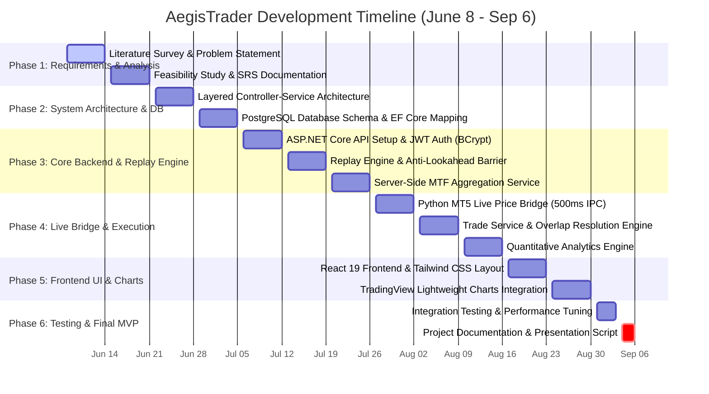

# AegisTrader — Gantt & PERT Charts (June 8 – September 6)

> **Chapter 6: System Planning & Scheduling Diagrams**  
> Timeline: **June 8, 2026 – September 6, 2026** (13 Weeks)

---

## 1. Gantt Chart (Project Schedule & Milestones)

---

## 2. PERT Chart (Program Evaluation and Review Technique)

```mermaid
flowchart LR
    %% Start Event Node
    Start(("Start Project<br/>Jun 08"))

    %% Task Activity Nodes (Task ID, Name, Expected Duration Te)
    T1["T1: Requirements & SRS<br/>Te = 14 Days"]
    T2["T2: Architecture & DB Design<br/>Te = 14 Days"]
    T3["T3: JWT Auth & API Setup<br/>Te = 7 Days"]
    T4["T4: Historical Replay Engine<br/>Te = 7 Days"]
    T5["T5: Server-Side MTF Aggregation<br/>Te = 7 Days"]
    T6["T6: Python MT5 Live Price Bridge<br/>Te = 7 Days"]
    T7["T7: Trade Execution & Overlap Engine<br/>Te = 7 Days"]
    T8["T8: Quantitative Analytics Service<br/>Te = 7 Days"]
    T9["T9: React 19 & Tailwind UI<br/>Te = 7 Days"]
    T10["T10: TradingView Charts Canvas<br/>Te = 7 Days"]
    T11["T11: Integration Testing<br/>Te = 4 Days"]
    T12["T12: Documentation & MVP Release<br/>Te = 3 Days"]

    %% Finish Milestone Event Node
    Finish(("MVP Release & Evaluation<br/>Sep 06"))

    %% Dependency Connections
    Start --> T1
    T1 --> T2
    T2 --> T3
    T3 --> T4
    T4 --> T5
    T5 --> T6
    T6 --> T7
    T7 --> T8
    T8 --> T9
    T9 --> T10
    T10 --> T11
    T11 --> T12
    T12 --> Finish

    %% Critical Path Highlighting
    style Start fill:#2563EB,stroke:#1D4ED8,color:#FFFFFF,stroke-width:2px;
    style Finish fill:#16A34A,stroke:#15803D,color:#FFFFFF,stroke-width:2px;
    style T1 stroke:#DC2626,stroke-width:3px;
    style T2 stroke:#DC2626,stroke-width:3px;
    style T4 stroke:#DC2626,stroke-width:3px;
    style T5 stroke:#DC2626,stroke-width:3px;
    style T7 stroke:#DC2626,stroke-width:3px;
    style T10 stroke:#DC2626,stroke-width:3px;
    style T11 stroke:#DC2626,stroke-width:3px;
    style T12 stroke:#DC2626,stroke-width:3px;
```

---

## 3. PERT Critical Path Task Table

| Task ID | Task Description | Predecessors | Optimistic ($O$) | Most Likely ($M$) | Pessimistic ($P$) | Expected ($T_e$) | Critical Path? |
| :--- | :--- | :--- | :--- | :--- | :--- | :--- | :--- |
| **T1** | Requirements & SRS Analysis | - | 10 days | 14 days | 18 days | **14.0 days** | Yes |
| **T2** | Architecture & DB Design | T1 | 10 days | 14 days | 18 days | **14.0 days** | Yes |
| **T3** | Auth & API Scaffold | T2 | 5 days | 7 days | 9 days | **7.0 days** | No |
| **T4** | Replay Engine & Timestamp Barrier | T3 | 5 days | 7 days | 9 days | **7.0 days** | Yes |
| **T5** | MTF Server-Side Aggregation | T4 | 5 days | 7 days | 9 days | **7.0 days** | Yes |
| **T6** | Python MT5 Live Price Bridge | T5 | 5 days | 7 days | 9 days | **7.0 days** | No |
| **T7** | Trade Execution & Overlap Engine | T6 | 5 days | 7 days | 9 days | **7.0 days** | Yes |
| **T8** | Analytics Service | T7 | 5 days | 7 days | 9 days | **7.0 days** | No |
| **T9** | React 19 Frontend UI Setup | T8 | 5 days | 7 days | 9 days | **7.0 days** | No |
| **T10** | TradingView Charts Canvas | T9 | 5 days | 7 days | 9 days | **7.0 days** | Yes |
| **T11** | Integration & Performance Testing | T10 | 3 days | 4 days | 5 days | **4.0 days** | Yes |
| **T12** | Documentation & Presentation Prep | T11 | 2 days | 3 days | 4 days | **3.0 days** | Yes |

*Formula used:* $T_e = \frac{O + 4M + P}{6}$
