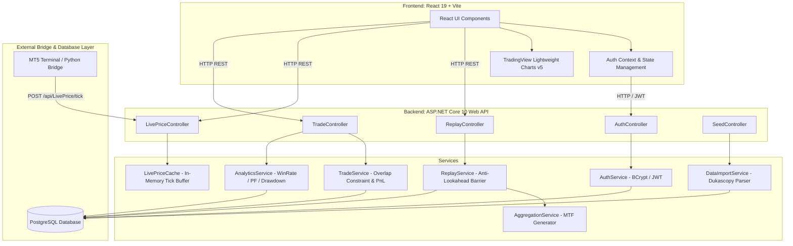
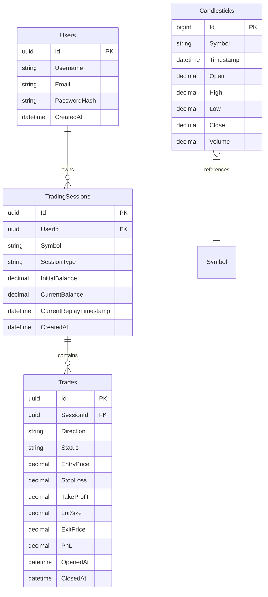

# AegisTrader — Enterprise Forex Backtesting, Real-Time Paper Trading & Analytics Platform

> **Academic Project & Technical Reference Documentation**  
> **Lead Engineer:** Abi Binu · MCA Batch 2025–2027  

---

## Executive Summary & MVP Readiness Assessment

**AegisTrader** is a full-stack, enterprise-grade trading simulation platform engineered for quantitative backtesting, live paper trading, and performance analytics. Specifically designed for **Inner Circle Trader (ICT)** and **Smart Money Concepts (SMC)** trading frameworks, the platform features a **deterministic historical replay engine** (with strict anti-lookahead timestamp protection) and a **real-time paper trading sandbox** powered by a **MetaTrader 5 (MT5) live price bridge**.

### College Project Evaluator Assessment: MVP Readiness

- **Status:** **100% Ready for Initial MVP Presentation & Evaluation.**
- **Key Milestones Achieved:**
  - **Full Stack Infrastructure:** ASP.NET Core 10 Web API + PostgreSQL (EF Core 10) + React 19 + Vite 8.
  - **Security & Authentication:** User registration/login with BCrypt password hashing and JWT Bearer token state management.
  - **Deterministic Replay Clock:** Zero-lookahead timestamp barrier restricting data visibility (`Timestamp <= CurrentReplayTimestamp`) with adjustable step-forward intervals (1m, 5m, 15m, 1H, 4H).
  - **Multi-Timeframe Aggregation Engine:** Server-side integer-division epoch grouping on 1-minute historical data without pre-calculated database tables.
  - **Live MT5 Price Feed Bridge:** Python bridge polling local MetaTrader 5 terminal (Vantage Markets demo) forwarding ticks at 500ms intervals with automatic simulation fallback.
  - **Financial & Execution Math:** 5-decimal Forex pip calculations, dynamic unrealized floating P&L, lot sizing, and pessimistic **Overlap Constraint** resolution (defensive SL execution when a single candle hits both SL and TP).
  - **Professional Visual Canvas:** TradingView Lightweight Charts v5 integration featuring candlesticks, SMA(20), volume histogram, interactive SL/TP horizontal lines, and order markers.
  - **Analytical Dashboard:** Real-time calculation of Win Rate %, Profit Factor, Max Drawdown %, Net P&L, and Total Trades.

---

## 1. System Architecture & Technical Stack

AegisTrader follows a clean layered architecture adhering to the **Controller-Service-Repository** design pattern with decoupled client-server communication via RESTful JSON endpoints.



### Technology Stack Summary

| Layer                      | Technology                                | Purpose                                                               |
| :------------------------- | :---------------------------------------- | :-------------------------------------------------------------------- |
| **Frontend Framework**     | React 19 (Hooks API), React Router v7     | Modular component composition and single-page routing                 |
| **Styling & Icons**        | Tailwind CSS v4, Lucide React             | Dark-mode financial layout and UI iconography                         |
| **Chart Visual Engine**    | TradingView Lightweight Charts v5         | Financial charting canvas (Candlesticks, Volume, Indicators, Markers) |
| **Backend API Framework**  | ASP.NET Core Web API (.NET 10 LTS)        | Enterprise backend API service layer                                  |
| **Database & ORM**         | PostgreSQL 16, Entity Framework Core 10   | Relational storage and ORM data access with code-first migrations     |
| **Authentication**         | JWT Bearer Tokens, BCrypt.NET-Next        | Secure stateless auth with encrypted passwords                        |
| **Live Price Bridge**      | Python 3.10+, `MetaTrader5` SDK, Requests | Local bridge piping tick data from Vantage MT5 terminal               |
| **Historical Data Source** | Dukascopy 1-Minute Forex OHLCV CSV        | 1,000,000+ rows of historical tick/candle data for EURUSD             |

---

## 2. Core Engine Specifications & Mathematical Algorithms

### 2.1 The Historical Replay Engine & Anti-Lookahead Barrier

To guarantee zero-lookahead bias during backtesting, the backend enforces an absolute timestamp barrier:

$$\text{Visible Candles} = \{ c \in \text{Candlesticks} \mid c.\text{Symbol} = S \land c.\text{Timestamp} \le T_{\text{Replay}} \}$$

```csharp
// ReplayService.cs: Timestamp Barrier Logic
public async Task<List<Candlestick>> GetVisibleCandlesAsync(Guid sessionId, string timeframe = "1m")
{
    var session = await _context.TradingSessions.FindAsync(sessionId);

    // Fetch raw 1m candles up to current replay clock
    var rawCandles = await _context.Candlesticks
        .Where(c => c.Symbol == session.Symbol && c.Timestamp <= session.CurrentReplayTimestamp)
        .OrderByDescending(c => c.Timestamp)
        .Take(200000) // Multi-timeframe buffer cap
        .OrderBy(c => c.Timestamp)
        .ToListAsync();

    // Aggregate to target timeframe
    return _aggregationService.AggregateCandles(rawCandles, timeframe).TakeLast(500).ToList();
}
```

### 2.2 Server-Side Multi-Timeframe (MTF) Aggregation Algorithm

Instead of storing duplicate tables for 5m, 15m, 1H, and 4H timeframes, `AggregationService.cs` dynamically groups 1-minute candles using integer division on Unix Epoch timestamps:

$$\text{BucketKey}(t, \Delta t) = \lfloor \frac{\text{UnixTimestamp}(t)}{60 \times \Delta t} \rfloor$$

```csharp
// AggregationService.cs: Dynamic Bar Aggregation
int intervalMinutes = timeframe switch {
    "5m" => 5, "15m" => 15, "1H" => 60, "4H" => 240, _ => 1
};

var grouped = candles
    .GroupBy(c => {
        var dto = DateTime.SpecifyKind(c.Timestamp, DateTimeKind.Utc);
        long epochMinutes = new DateTimeOffset(dto).ToUnixTimeSeconds() / 60;
        return epochMinutes - (epochMinutes % intervalMinutes);
    });

foreach (var group in grouped) {
    var list = group.OrderBy(c => c.Timestamp).ToList();
    aggregated.Add(new Candlestick {
        Timestamp = DateTimeOffset.FromUnixTimeSeconds(group.Key * 60).UtcDateTime,
        Open = list.First().Open,
        High = list.Max(c => c.High),
        Low = list.Min(c => c.Low),
        Close = list.Last().Close,
        Volume = list.Sum(c => c.Volume)
    });
}
```

### 2.3 Financial Mathematics & Pip P&L Model

Forex price changes are measured in **Pips** ($1 \text{ Pip} = 0.00010$ on 5-decimal pairs like EURUSD).

$$\text{Pips}_{\text{Buy}} = (\text{ExitPrice} - \text{EntryPrice}) \times 10,000$$

$$\text{Pips}_{\text{Sell}} = (\text{EntryPrice} - \text{ExitPrice}) \times 10,000$$

$$\text{Net PnL (\$) } = \text{Pips} \times \text{LotSize} \times \text{PipValue} \quad (\text{where PipValue} = \$10.00 \text{ per standard lot})$$

```csharp
// TradeService.cs: Forex Pip & P&L Calculation
public static decimal CalculatePnL(string direction, decimal entry, decimal exit, decimal lots)
{
    decimal pips = direction == "Buy"
        ? (exit - entry) * 10000m
        : (entry - exit) * 10000m;
    return pips * lots * 10.00m; // $10 per pip per lot on EURUSD
}
```

### 2.4 Defensive Overlap Constraint (Extreme Volatility Resolution)

When market volatility causes a single candle's range ($\text{Low} \dots \text{High}$) to cross **both** Take Profit and Stop Loss boundaries simultaneously, standard simulators yield ambiguous results. AegisTrader implements a **Pessimistic Defensive Resolution**:

```csharp
// TradeService.cs: Overlap Resolution
bool hitSL = trade.Direction == "Buy" ? candle.Low <= trade.StopLoss : candle.High >= trade.StopLoss;
bool hitTP = trade.Direction == "Buy" ? candle.High >= trade.TakeProfit : candle.Low <= trade.TakeProfit;

if (hitSL && hitTP) {
    // Both hit in single bar -> Force Stop Loss closure (Pessimistic Slippage Simulation)
    CloseTrade(trade, trade.StopLoss, "Closed via Stop Loss (Overlap Violation)");
} else if (hitSL) {
    CloseTrade(trade, trade.StopLoss, "Closed via Stop Loss");
} else if (hitTP) {
    CloseTrade(trade, trade.TakeProfit, "Closed via Take Profit");
}
```

### 2.5 Quantitative Analytics Engine

Metrics are computed over closed trades in `AnalyticsService.cs`:

1. **Win Rate (%):**
   $$\text{Win Rate} = \left( \frac{\text{Winning Trades}}{\text{Total Closed Trades}} \right) \times 100$$

2. **Profit Factor (PF):**
   $$\text{Profit Factor} = \frac{\sum \text{Gross Profits}}{\sum |\text{Gross Losses}|}$$

3. **Max Drawdown (%):**
   Tracked dynamically across the historical balance curve:
   $$\text{Drawdown}_t = \frac{\text{Peak Balance}_t - \text{Current Balance}_t}{\text{Peak Balance}_t} \times 100$$
   $$\text{Max Drawdown} = \max_{t} (\text{Drawdown}_t)$$

---

## 3. Database Schema & Data Modeling

The database uses PostgreSQL with EF Core migrations. All financial decimal columns are configured to `decimal(18,6)` for 5-decimal Forex accuracy.



### Database Optimization: Composite Index

To achieve sub-millisecond replay lookups over 1,000,000+ records, `Candlesticks` table uses a composite index:

```csharp
modelBuilder.Entity<Candlestick>()
    .HasIndex(c => new { c.Symbol, c.Timestamp });
```

---

## 4. API Endpoint Specifications

All endpoints (except `/api/Auth/*`) require a valid JWT Bearer header: `Authorization: Bearer <token>`.

| Category   | Method | Endpoint                           | Query / Body Parameters                                    | Response Payload Description                                    |
| :--------- | :----- | :--------------------------------- | :--------------------------------------------------------- | :-------------------------------------------------------------- |
| **Auth**   | `POST` | `/api/Auth/register`               | `{ username, email, password }`                            | `{ token, user: { id, username, email } }`                      |
| **Auth**   | `POST` | `/api/Auth/login`                  | `{ email, password }`                                      | `{ token, user: { id, username, email } }`                      |
| **Replay** | `POST` | `/api/Replay/start`                | `symbol`, `initialBalance`, `startTime`                    | `{ sessionId, symbol, currentBalance, currentReplayTimestamp }` |
| **Replay** | `GET`  | `/api/Replay/{id}`                 | Path: `id` (Session GUID)                                  | Returns full `TradingSession` entity                            |
| **Replay** | `GET`  | `/api/Replay/{id}/candles`         | `timeframe` (1m, 5m, 15m, 1H, 4H)                          | `List<CandlestickDto>` (max 500 bars)                           |
| **Replay** | `POST` | `/api/Replay/{id}/step`            | `minutes` (e.g. 15)                                        | `{ currentReplayTimestamp, currentBalance }`                    |
| **Live**   | `GET`  | `/api/LivePrice/history`           | `symbol`, `count` (default 500)                            | Historical baseline `List<CandlestickDto>`                      |
| **Live**   | `GET`  | `/api/LivePrice/latest`            | `symbol`                                                   | `{ symbol, bid, ask, timestamp }`                               |
| **Live**   | `POST` | `/api/LivePrice/tick`              | `{ Symbol, Bid, Ask }`                                     | `{ success: true, timestamp }`                                  |
| **Trade**  | `POST` | `/api/Trade/open`                  | `sessionId`, `direction`, `stopLoss`, `takeProfit`, `lots` | `Trade` entity (Status: Open)                                   |
| **Trade**  | `POST` | `/api/Trade/close/{id}`            | Path: `id` (Trade GUID)                                    | Closed `Trade` entity with calculated `PnL`                     |
| **Trade**  | `GET`  | `/api/Trade/history/{sessionId}`   | Path: `sessionId`                                          | `List<Trade>` (Open & Closed)                                   |
| **Trade**  | `GET`  | `/api/Trade/analytics/{sessionId}` | Path: `sessionId`                                          | `{ totalTrades, winRate, profitFactor, maxDrawdown, netPnL }`   |
| **Seed**   | `POST` | `/api/Seed/import-file`            | `filePath`                                                 | Summary count of imported CSV candles                           |

---

## 5. Developer Setup & Deployment Guide

### Prerequisites

1. **.NET 10 SDK** — `dotnet --version` (10.0+)
2. **Node.js 20+ & npm** — `node -v` (v20+)
3. **PostgreSQL 16** running locally on default port `5432`
4. **Python 3.10+** (Optional: MetaTrader 5 terminal installed for live bridge)

### Step 1: Database Setup

1. Create a PostgreSQL database named `aegistrader_db`.
2. Configure connection string in `AegisTrader.API/appsettings.json`:
   ```json
   "ConnectionStrings": {
     "DefaultConnection": "Host=localhost;Port=5432;Database=aegistrader_db;Username=postgres;Password=your_password"
   }
   ```
3. Run EF Core migrations to generate database tables:
   ```bash
   cd AegisTrader.API
   dotnet ef database update
   ```

### Step 2: Seed Historical Forex Data

1. Download or locate a Dukascopy EURUSD 1-minute CSV file.
2. Launch the backend API:
   ```bash
   cd AegisTrader.API
   dotnet run
   ```
3. Trigger file import via HTTP POST (or Swagger at `http://localhost:5273/swagger`):
   ```http
   POST http://localhost:5273/api/Seed/import-file?filePath=C:\path\to\EURUSD_1m.csv
   ```

### Step 3: Run MT5 Live Price Bridge (Python)

```bash
# Run local Python bridge (automatically uses MT5 or realistic simulator fallback)
python bridge/mt5_bridge.py
```

### Step 4: Run Frontend Client

```bash
cd AegisTrader.Frontend
npm install
npm run dev
# Open browser at http://localhost:5173
```

---

## 6. College Evaluator Presentation Guide & Demo Script

When presenting AegisTrader to your project evaluator, follow this step-by-step demonstration flow to showcase full-stack technical depth:

1. **Authentication & Security (1 Min):**
   - Demonstrate user Registration and Login (`/login`). Show JWT token storage in `localStorage` and request authorization header interceptors in Chrome DevTools Network tab.

2. **Real-Time Live Sandbox & MT5 Bridge (3 Mins):**
   - Navigate to `/live`. Show live tick price updates ticking every 500ms in top header.
   - Open terminal running `python bridge/mt5_bridge.py` side-by-side with the web browser to show real-time IPC (Inter-Process Communication) pushing ticks from MT5 -> API -> React UI.
   - Execute a live market trade (Buy/Sell) with custom SL/TP levels. Point out the interactive visual order lines on the chart and dynamic floating unrealized P&L updating live on every tick.

3. **Deterministic Replay & Multi-Timeframe Engine (3 Mins):**
   - Navigate to `/replay`. Explain the **Anti-Lookahead Timestamp Barrier** preventing future bar visibility.
   - Demonstrate multi-timeframe switching (1m -> 5m -> 15m -> 1H -> 4H). Explain how the backend `AggregationService` performs integer-division epoch grouping on raw candles on-the-fly.
   - Use the **Step Forward** controls (+1m, +15m, +1H) to advance price forward, triggering automated SL/TP trade closures.

4. **Quantitative Analytics Dashboard (2 Mins):**
   - Navigate to `/analytics/:sessionId`. Highlight the performance breakdown: Win Rate %, Profit Factor, Max Drawdown %, Net P&L, and closed trades audit table.
   - Explain the financial formulas (pip conversion, gross profit / gross loss, high-water mark drawdown tracking).

---

## 7. Future System Roadmap

- [ ] **Phase 3:** Automated Strategy Scripting Engine (Custom PineScript / C# algorithm execution).
- [ ] **Phase 4:** AI-assisted Trade Journal & Pattern Recognition (Auto-detecting Fair Value Gaps & Order Blocks).
- [ ] **Phase 5:** Multi-Asset Expansion (XAUUSD Gold, Crypto BTCUSD, Index Futures NQ/ES).

---

_AegisTrader — Engineered for Quantitative Trading Excellence._  
_Lead Developer: Abi Binu · MCA Batch 2025–2027_
